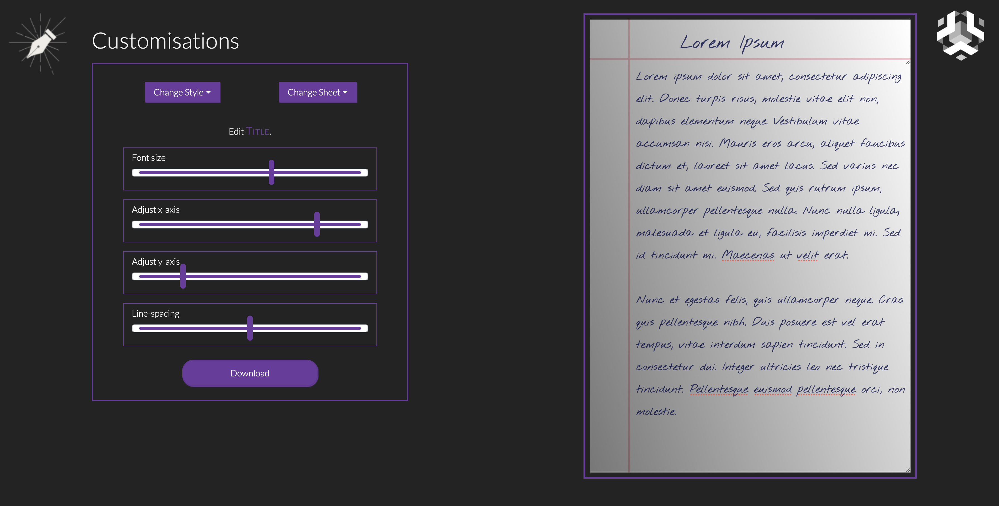

<p align="center">
<a href="https://dscommunity.in">
	
</a>
	<h2 align="center">Doc Writer</h2>
	<h4 align="center"> An easy to use one stop solution for generating handwritten documents without actually having to write one. Doc Writer is a savior for all those, who need to complete Handwritten work, without actually having to write one. Be it your assignments, home work or any other tasks, use it for all. <h4>
</p>

---

[](INSERT_LINK_FOR_DOCS_HERE)
[](INSERT_UI_LINK_HERE)

## Preview

- 

## Functionalities

- [ ] Input text
- [ ] Change Font Style
- [ ] Change Sheet
- [ ] Adjust Font size
- [ ] Adjust x-axis and y-axis
- [ ] Adjust Line spacing
- [ ] Download the File

<br>

## Instructions to run

- Pre-requisites: -  Node.js > V8.x and npm 5.2+ is a minimum requirement.

- < directions to install >

```bash
# install dependencies
npm install
```

- < directions to execute >

```bash

# serve with hot reload at localhost:8080
npm run dev

# build for production with minification
npm run build

# test the production build locally
npm run serve

# run tests with jest and preact-render-spy 
npm run test
```
For detailed explanation on how things work, checkout the [CLI Readme](https://github.com/developit/preact-cli/blob/master/README.md).

## Contributors

<table>
<tr align="center">

<td>

Ria Tyagi

<p align="center">

</p>
<p align="center">
<a href = "https://github.com/riasenpai"></a>
<a href = "https://www.linkedin.com/in/person1">

</a>
</p>
</td>

<td>

Shubham Deodhar

<p align="center">

</p>
<p align="center">
<a href = "https://github.com/ShubhamDeodhar"></a>
<a href = "https://www.linkedin.com/in/shubham-deodhar-248bb818a">

</a>
</p>
</td>

<td>

Sakshi Choudhary

<p align="center">

</p>
<p align="center">
<a href = "https://github.com/sakshi-choudhary"></a>
<a href = "https://www.linkedin.com/in/sakshichoudhary23">

</a>
</p>
</td>
</tr>
  </table>
  
## License
[](http://badges.mit-license.org)

<p align="center">
	Made with :heart: by <a href="https://dscommunity.in">DS Community SRM</a>
</p>
